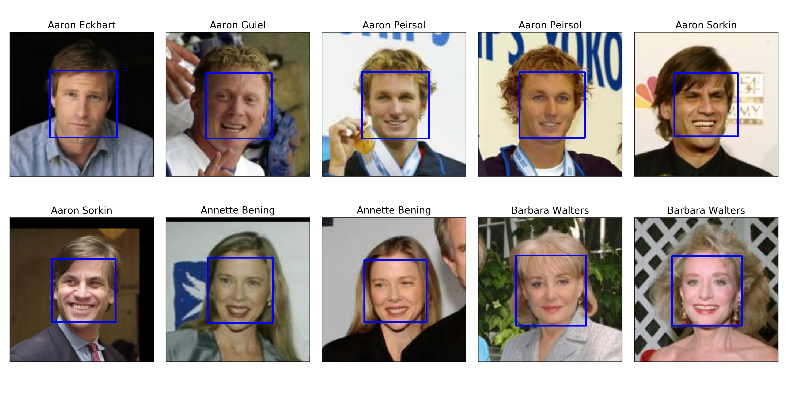
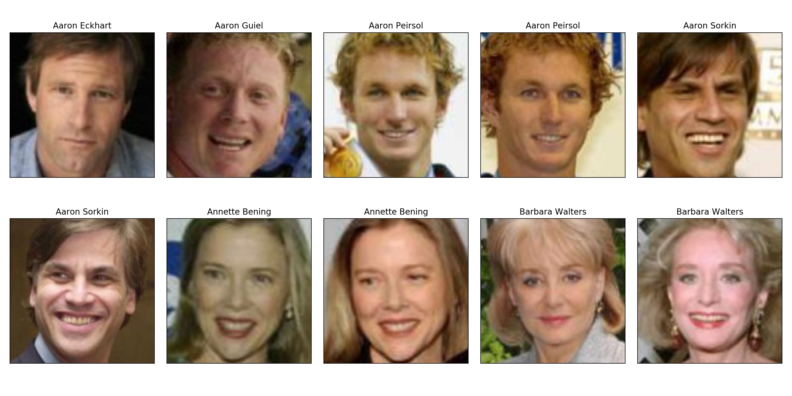
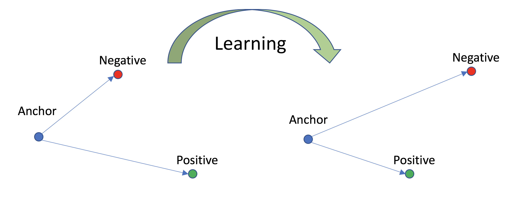

# Face-Verification
Repository for Face Detection and Verification Systems

***
## Tasks
+ [x] Face Detection
    - [x] Haar Cascade Classifier
    - [x] LBP Classifier (not actually implemented)
+ [ ] Face Alignment
    - [ ] TBD
+ [x] Face Verification
    - [x] Base CNN model building and training
    - [x] Face verification metric measure
+ [ ] Liveness Verification
    - [ ] Eye-blink
    - [ ] TBD
+ [ ] Interface or API
    - [ ] TBD

***
## Demo

#### 1. Face Detection --> [OpenCV Haar Feature-based Cascade Classifiers](https://docs.opencv.org/3.3.0/d7/d8b/tutorial_py_face_detection.html)
* Sample Input Images  

* Frontal Face Detection  

* Frontal Face Crop  

* Check [Jupyter Notebook](https://github.com/JifuZhao/face-verification/blob/master/5.%20FaceNet%20Application%20Demo.ipynb) for details.

#### 2. Base CNN Model for Face Verification
+ Training Dataset: [VGGFace2 Dataset](http://www.robots.ox.ac.uk/~vgg/data/vgg_face2/)
+ Triplet Loss  

    * a: anchor image
    * p: positive image
    * n: negative image
    * f(x): CNN model to encode the input image
    * $\alpha$: margin for triplet  
    

#### 3. Face Verification

#### 4. Performance

***
### Useful Links:
* [FaceNet: A Unified Embedding for Face Recognition and Clustering](https://arxiv.org/abs/1503.03832)
* [Deep face recognition with Keras, Dlib and OpenCV](https://krasserm.github.io/2018/02/07/deep-face-recognition/)
* [Face detection with OpenCV and deep learning](https://www.pyimagesearch.com/2018/02/26/face-detection-with-opencv-and-deep-learning/)
* [Face recognition using Tensorflow](https://github.com/davidsandberg/facenet)
* [The world's simplest facial recognition api for Python and the command line](https://github.com/ageitgey/face_recognition)

***
#### Note
Limited by computation resources, a relatively small CNN model is used, and the model is only trained for 1,000 epochs. For better performance, please refer to other pre-trained models.

Copyright @ Jifu Zhao 2018
